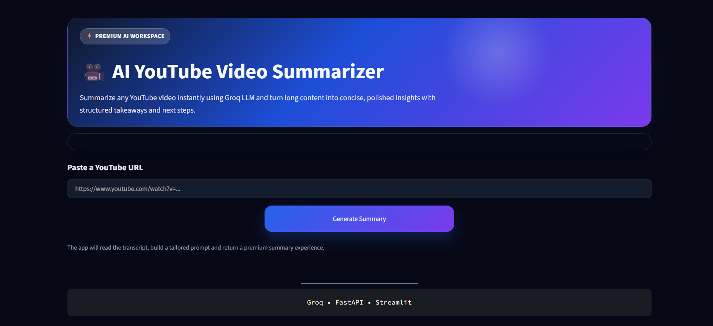
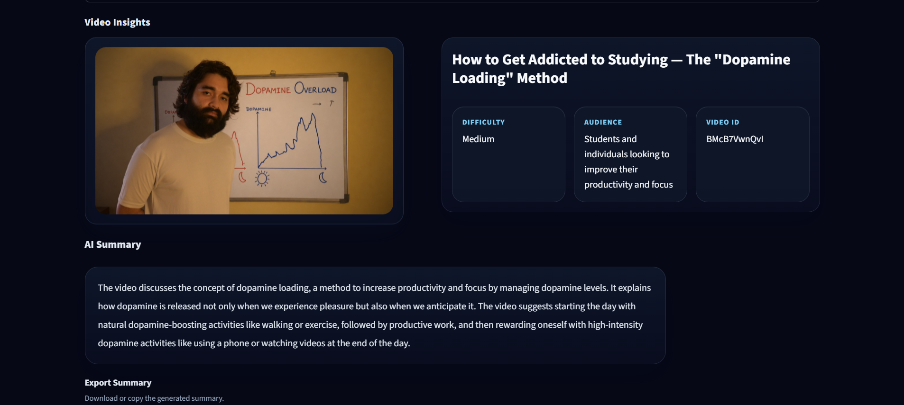

# 🎥 AI YouTube Video Summarizer

An AI-powered web application that transforms YouTube videos into concise, structured summaries using **Groq LLM**, **FastAPI**, and **Streamlit**.

Simply paste a YouTube video URL and receive an AI-generated summary with key points, takeaways, keywords, target audience, difficulty level, and recommended next steps.

---

## ✨ Features

- 🎥 Summarize any YouTube video using its URL
- 🤖 AI-powered summaries with Groq LLM
- 📝 Automatic transcript extraction
- 📌 Structured summary
- ⭐ Key Points
- 💡 Takeaways
- 🏷️ Keywords
- 🎯 Target Audience
- 📊 Difficulty Level
- 🚀 Recommended Next Steps
- 📥 Download summaries as **JSON** or **Markdown**
- 🎨 Modern Streamlit interface

---

## 🛠️ Tech Stack

- Python
- FastAPI
- Streamlit
- Groq API
- yt-dlp
- YouTube Transcript API
- Python Dotenv

---

## 📂 Project Structure

```text
youtube-video-summarizer/
│
├── screenshots/          # README screenshots
├── ai_backend.py         # AI summarization pipeline
├── server.py             # FastAPI backend
├── ui.py                 # Streamlit frontend
├── prompt.md             # Prompt template
├── requirements.txt      # Dependencies
├── README.md             # Documentation
├── .gitignore            # Git ignore rules
└── .env                  # API key (not pushed to GitHub)
```

---

## 🚀 Getting Started

### 1️⃣ Clone the Repository

```bash
git clone https://github.com/YOUR_USERNAME/youtube-video-summarizer.git

cd youtube-video-summarizer
```

---

### 2️⃣ Create a Virtual Environment (Recommended)

**Windows**

```bash
python -m venv .venv

.venv\Scripts\activate
```

**Linux / macOS**

```bash
python3 -m venv .venv

source .venv/bin/activate
```

---

### 3️⃣ Install Dependencies

```bash
pip install -r requirements.txt
```

---

### 4️⃣ Configure Environment Variables

Create a `.env` file in the project root.

```text
GROQ_API_KEY=your_groq_api_key_here
```

---

### 5️⃣ Start the Backend

```bash
uvicorn server:app --reload
```

The FastAPI server will start at

```
http://127.0.0.1:8000
```

---

### 6️⃣ Launch the Frontend

```bash
streamlit run ui.py
```

The Streamlit application will open automatically in your browser.

---

## 🚀 Demo

The application allows users to:

- Paste any YouTube video URL
- Generate an AI-powered structured summary
- View key points, takeaways, keywords, audience, and difficulty
- Download the generated summary as JSON or Markdown

---

## 📷 Screenshots

### Home Page



---

### Generated Summary



---

## 🔄 How It Works

```text
YouTube URL
      │
      ▼
Extract Video Information
      │
      ▼
Fetch Transcript
      │
      ▼
Build Prompt
      │
      ▼
Groq LLM
      │
      ▼
Generate Structured Summary
      │
      ▼
Display Results in Streamlit
```

---

## 🎯 Future Improvements

- 🌍 Multi-language support
- 💬 Chat with YouTube videos
- 📄 PDF export
- 📚 Summary history
- 👤 User authentication
- 🎙️ Support videos without transcripts

---

## 📄 License

This project was developed for educational purposes as part of the **Samsung Innovation Campus GenAI Program**.

---

## 👨‍💻 Authors

- **Prashant**
- **Suhana**
