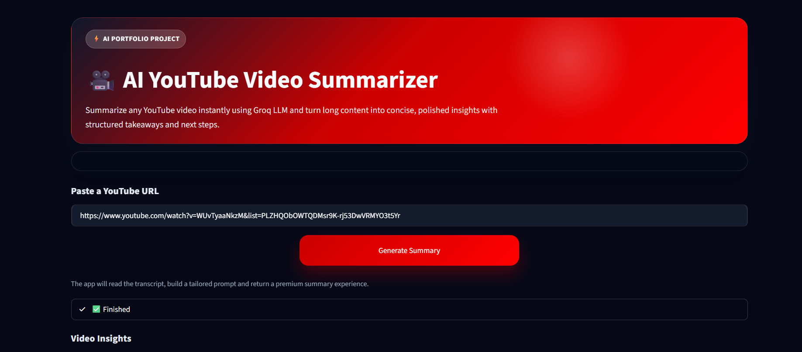
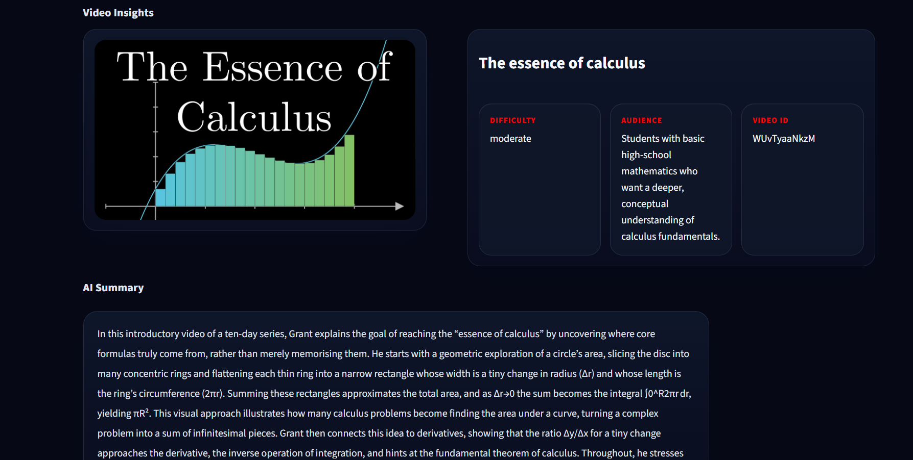

# 🎥 AI YouTube Video Summarizer

An AI-powered web application that converts YouTube videos into concise, structured summaries using **Groq LLM, FastAPI, Streamlit, and RapidAPI**.

🔗 **Live Demo:** https://youtube-video-summarizer-frontend.onrender.com/

---

## ✨ Features

- 🎥 Summarize YouTube videos from a URL
- 🤖 AI-generated structured summaries
- 📝 Automatic transcript extraction
- ⭐ Key points and takeaways
- 🏷️ Keywords
- 🎯 Target audience
- 📊 Difficulty level
- 🚀 Recommended next steps
- 📥 Download summaries as JSON or Markdown
- ☁️ Deployed frontend and backend

---

## 🛠️ Tech Stack

- **Frontend:** Streamlit
- **Backend:** FastAPI
- **AI:** Groq API (`openai/gpt-oss-120b`)
- **Transcript:** RapidAPI + YouTube Transcript API fallback
- **Video Metadata:** YouTube oEmbed / yt-dlp
- **Language:** Python

---

## 🖥️ Screenshots

### 🏠 Home Page

<!-- Replace with your screenshot -->

### 📊 Generated Summary

<!-- Replace with your screenshot -->

---

## 🔄 How It Works

~~~text
YouTube URL
     ↓
Streamlit Frontend
     ↓
FastAPI Backend
     ↓
RapidAPI Transcript
     ↓
Groq LLM
     ↓
Structured Summary
     ↓
Streamlit UI
~~~

---

## 🚀 Run Locally

### 1. Clone the Repository

~~~bash
git clone https://github.com/YOUR_USERNAME/youtube-video-summarizer.git
cd youtube-video-summarizer
~~~

### 2. Create Environment & Install Dependencies

**Windows:**

~~~bash
python -m venv .venv
.venv\Scripts\activate
pip install -r requirements.txt
~~~

**Linux / macOS:**

~~~bash
python3 -m venv .venv
source .venv/bin/activate
pip install -r requirements.txt
~~~

### 3. Configure Environment Variables

Create a `.env` file in the project root:

~~~text
GROQ_API_KEY=your_groq_api_key
RAPIDAPI_KEY=your_rapidapi_key
RAPIDAPI_HOST=youtube-transcriptor.p.rapidapi.com
BACKEND_URL=http://127.0.0.1:8000
~~~

### 4. Start the Backend

~~~bash
python -m uvicorn server:app --reload
~~~

FastAPI runs at:

~~~text
http://127.0.0.1:8000
~~~

### 5. Start the Frontend

Open another terminal:

~~~bash
python -m streamlit run ui.py
~~~

---

## ☁️ Deployment

The application is deployed on **Render** as two services:

~~~text
Streamlit Frontend
        ↓
FastAPI Backend
        ↓
RapidAPI + Groq
~~~

**Frontend:** `https://youtube-video-summarizer-frontend.onrender.com/`

**Backend:** `https://youtube-video-summarizer-cmhe.onrender.com`

### Backend Environment Variables

~~~text
GROQ_API_KEY
RAPIDAPI_KEY
~~~

### Frontend Environment Variable

~~~text
BACKEND_URL=https://youtube-video-summarizer-cmhe.onrender.com
~~~

---

## 📂 Project Structure

~~~text
youtube-video-summarizer/
│
├── ai_backend.py
├── server.py
├── ui.py
├── prompt.md
├── requirements.txt
├── README.md
├── screenshots/
└── .gitignore
~~~

---

## 🔮 Future Improvements

- 🌍 Multi-language summaries
- 💬 Chat with YouTube videos
- 📄 PDF export
- 📚 Summary history
- 👤 User authentication
- 🗄️ Database integration

---

## 📄 License

Developed for educational purposes as part of the **Samsung Innovation Campus GenAI Program**.

## 👨‍💻 Author

**Prashant** 
